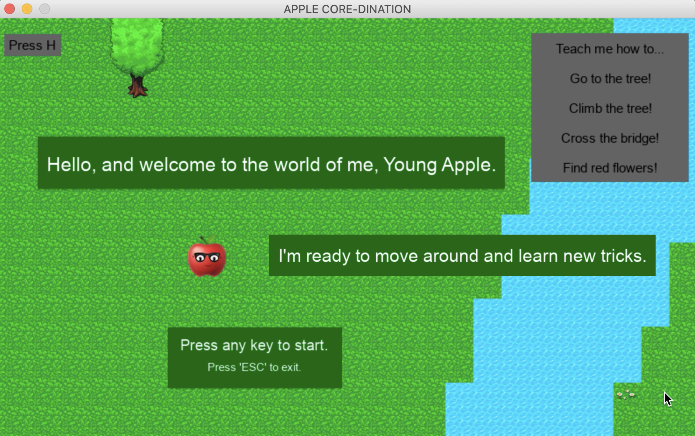

# Apple Core-dination

*Shared World Voice-Controlled Game*

Language, Action, & Perception Software Project

Winter 2020-2021

	

## How to Play

### Download Game Files
1. Clone repository or download zip file.
2. Have Python 3 installed, or download it [here](https://www.python.org/).
3. To install dependencies, do 1 of the following 2 options: 
	1. Run `pip install -r requirements.txt` to install dependencies.
		- *You may need to install PyAudio manually. Refer to [SpeechRecognition site](https://pypi.org/project/SpeechRecognition/#pyaudio-for-microphone-users) to install according to your operating system.*
		- *You may need to install SpeechBrain directly from GitHub: https://github.com/speechbrain/speechbrain#quick-installation*

	2. Alternatively, install the `applecore.yml` file:
		* Download [conda](https://docs.conda.io/projects/conda/en/latest/user-guide/install/download.html). 
		* `conda env create -f applecore.yml`
		* `conda activate applecore`
		* Install SpeechBrain from: https://github.com/speechbrain/speechbrain#quick-installation

4. Navigate to `gamefiles/` on local machine.
5. Run `python3 game.py` or `python game.py` to play the game.
